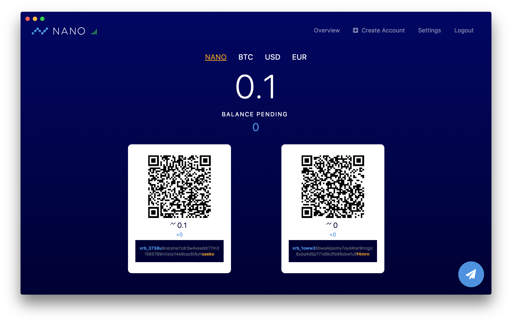

# Bitcoin-Black Desktop Wallet

An ambitious Bitcoin-Black wallet for desktop and web.

This is an Ember application that can build into an [Electron](https://electronjs.org/) app.

## Prerequisites

You will need the following things properly installed on your computer.

* [Git](https://git-scm.com/)
* [Node.js](https://nodejs.org/)
* [Yarn](https://yarnpkg.com/)
* [Google Chrome](https://google.com/chrome/)

## Installation

* `git clone https://github.com/bitcoin-black/bcb-wallet-desktop.git`
* `cd bcb-wallet-desktop`
* `yarn install`

## Running / Development

### Simple
* `yarn electron:start`
* The app will open in standalone electron session with developer tools

### Standalone node
* Make sure you have `bcb_node` running with the following settings:
  * `"rpc_enable: "true"`
  * `"port": "55000"`
  * `"enable_control": "true"`
* Run `yarn start`
* Visit the app at [http://localhost:4200](http://localhost:4200).
* Visit the tests at [http://localhost:4200/tests](http://localhost:4200/tests).

### Code Generators

Make use of the many generators for code, try `npx ember help generate` for more details.

### Running Tests

* `yarn test`
* `yarn test --server`

### Linting

* `yarn lint:js`
* `yarn lint:js --fix`

### Building

* `yarn build` (development)
* `yarn build --environment production` (production)

### Using Docker Compose

You can optionally develop and test using [Docker Compose](https://docs.docker.com/compose/).

* `docker-compose build`
* `docker-compose run --rm --service-ports app`

### Deploying

Specify what it takes to deploy your app.

## Further Reading / Useful Links

* [ember.js](https://emberjs.com/)
* [ember-cli](https://ember-cli.com/)
* Development Browser Extensions
* [ember inspector for chrome](https://chrome.google.com/webstore/detail/ember-inspector/bmdblncegkenkacieihfhpjfppoconhi)
* [ember inspector for firefox](https://addons.mozilla.org/en-US/firefox/addon/ember-inspector/)

